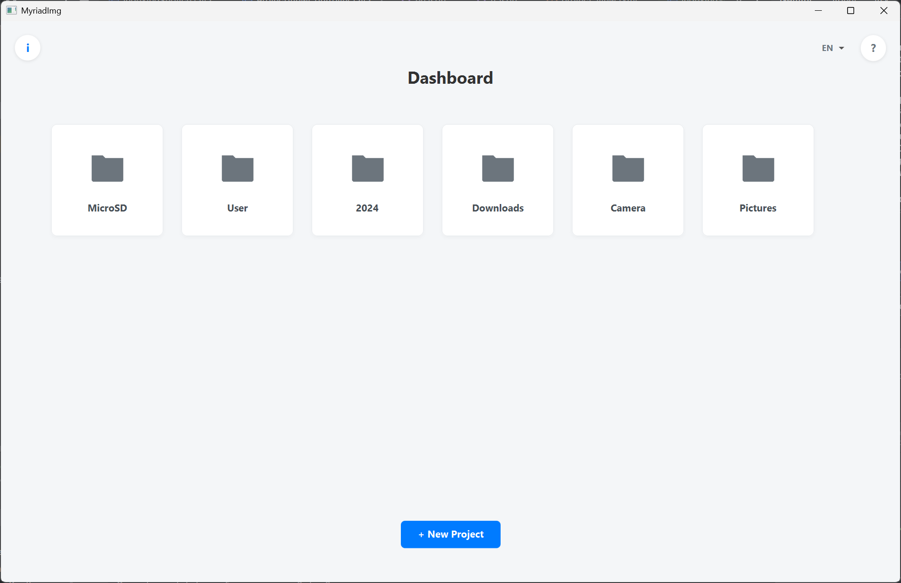
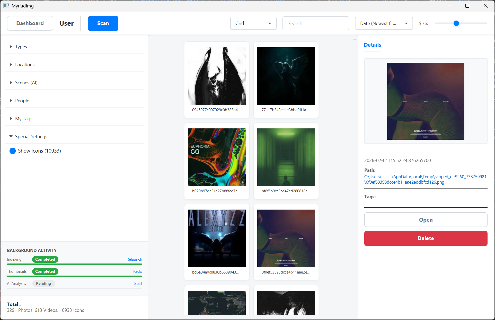
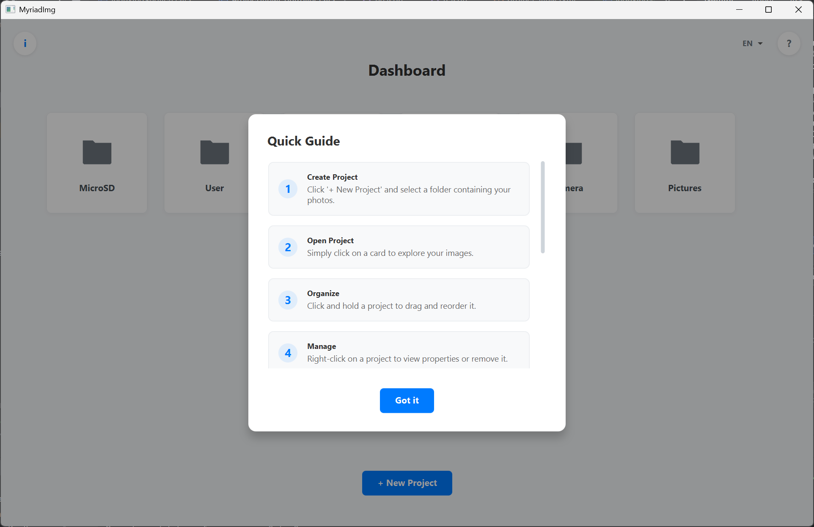
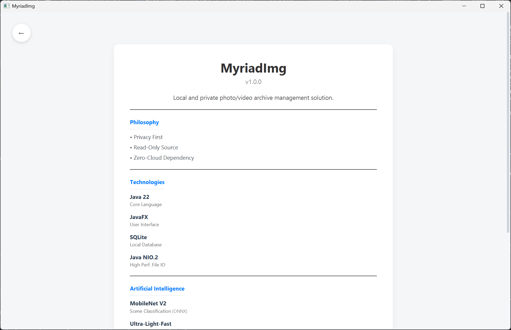

# MyriadImg 📸

> **Local, Private, and AI-Assisted Digital Asset Management (DAM).**

## ⚠️ Project Status: On Hold

**This project is currently on hold indefinitely.**

While functional in its core aspects, the codebase has reached a level of complexity that requires **major refactoring**. The current codebase (an advanced "Proof of Concept") has accumulated technical debt, making it difficult to add new features without breaking existing ones.

I currently do not have the availability or immediate motivation to undertake this cleanup, but the code remains available as a reference for a local DAM architecture in JavaFX. **However, I might resume development in the future if motivation returns.**

---

## 🎯 Project Goal

**MyriadImg** was born from frustration: the inability to manage massive photo archives (several Terabytes) without relying on the Cloud (Google Photos, iCloud) and without monthly subscriptions.

The philosophy is **"Privacy First" & "Zero-Cloud"**:
1.  **Local Only:** No data leaves your machine.
2.  **Read-Only Source:** Your original files are never modified.
3.  **Artificial Intelligence:** Uses local Deep Learning models to classify and retrieve your memories.

## 🛠 Possible Uses

*   **Personal Archives:** Scan external hard drives, USB keys, and local folders to create a single searchable index.
*   **Semantic Search:** Find photos by typing "Beach", "Car", or "Mountain" without manual tagging (via AI).
*   **Face Recognition:** Group photos by person (local clustering).
*   **Offline Geolocation:** Visualize where photos were taken without external API calls (Integrated Reverse Geocoding).
*   **Cleanup:** Identify duplicates and "system" files (icons, caches) that pollute your albums.
*   **Enterprise / Large Scale (Hypothetical):** While not currently implemented, the architecture is designed to support a **"Server Mode"**. In this scenario, heavy AI processing could run on a dedicated server to generate the `.db` index. This portable file could then be distributed to client machines, ensuring data remains ultra-portable and private, even for massive datasets.

## 🔭 Vision vs. Current Progress

| Feature | Vision (Goal) | Current State (Reality) |
| :--- | :--- | :--- |
| **Indexing** | Ultra-fast background scan of millions of files. | **Excellent.** Very performant local scanning. Only cloud interactions (OneDrive/iCloud sync status) are missing. |
| **Interface (UI)** | Fluid, modern, "Pinterest" or "Photos" style. | **Needs Work.** Grid and Folder views need significant polish and better virtualization logic. |
| **AI (Scenes)** | Precise detection of 1000+ objects. | **Not Started.** The infrastructure is there (DJL), but the actual image processing pipeline implementation hasn't begun. |
| **AI (Faces)** | Automatic clustering and easy naming. | **Not Started.** Face detection and clustering logic are not implemented yet. |
| **Geolocation** | Interactive world map. | **Partial.** GPS -> City conversion implemented (text only). No "Map" view. |
| **Architecture** | Modular, Clean Architecture. | **Needs Review.** Coupling between UI and Services is too strong. |

## 📸 Interface Preview

Here is what the application looks like in its current version:

| **Dashboard (Projects)** | **Project View (Grid)** |
| :---: | :---: |
|  |  |
| *Overview of all managed archives* | *Main gallery with infinite scroll* |

| **Quick Guide** | **About Page** |
| :---: | :---: |
|  |  |
| *Built-in tutorial for new users* | *Technical details and philosophy* |

*(Note: Images are located in the `docs/images/` folder)*

## 🏗 Technical Stack

*   **Language:** Java 22 (LTS)
*   **UI:** JavaFX (with modern CSS)
*   **Database:** SQLite (single portable `.db` file)
*   **AI / Deep Learning:** DJL (Deep Java Library) with PyTorch/ONNX engine.
*   **Geolocation:** Spatial4j + `cities15000.txt` database.
*   **Build:** Maven

## 📜 License

This project is licensed under the **GNU General Public License v3.0 (GPLv3)**.

**Why GPLv3?**
I believe that software should be free and accessible to everyone. The GPLv3 ensures that this project remains free software for all its users. It guarantees your freedom to share and change all versions of the program, while ensuring that any modifications or derived works also remain free and open source.

See the [LICENSE](LICENSE) file for details.

## 🤝 Contributing

Although I am not actively developing new features at the moment, **contributions are welcome!** If you want to tackle the refactoring or implement the missing AI features, feel free to fork the repository.

I am still available to:
*   Review Pull Requests.
*   Answer technical questions about the current architecture.
*   Provide guidance on how to implement specific features.

### Code of Conduct

This project adheres to a simple Code of Conduct:
1.  **Be Respectful:** Treat everyone with respect and kindness.
2.  **Be Constructive:** Feedback should be helpful and actionable.
3.  **No Harassment:** Harassment of any kind will not be tolerated.

## ⚖️ Credits & Licenses

This project relies on several open-source components and datasets. We gratefully acknowledge their contributions:

*   **FFmpeg / JavaCV:** Used for high-performance video decoding and HEIC conversion.
    *   *License:* LGPL v2.1+ / GPL v2+
    *   *Source:* [FFmpeg](https://ffmpeg.org/) & [JavaCV](https://github.com/bytedeco/javacv)
*   **GeoNames:** The offline reverse geocoding feature uses the `cities15000.txt` dataset.
    *   *License:* Creative Commons Attribution 4.0 License
    *   *Source:* [GeoNames](http://www.geonames.org/)
*   **Deep Java Library (DJL):** The backbone of our AI inference engine.
    *   *License:* Apache License 2.0
    *   *Source:* [DJL.ai](https://djl.ai/)
*   **Metadata Extractor:** For robust EXIF/IPTC parsing.
    *   *License:* Apache License 2.0
    *   *Source:* [Drewnoakes](https://github.com/drewnoakes/metadata-extractor)
*   **Icons:** Some UI icons are provided by [FontAwesome](https://fontawesome.com/) (Free License).

## 🛑 What Remains to be Done (Refactoring)

If development were to resume, here are the priorities:
1.  **AI Implementation:** The entire AI image processing pipeline (Scene Classification & Face Recognition) is **not implemented yet**. Only the dependencies (DJL) are present.
2.  **UI Polish:** The Grid and Folder views require significant work to be truly fluid and user-friendly.
3.  **Decoupling UI/Logic:** Too much business logic still resides in JavaFX `Controllers`. Migration to a stricter MVVM architecture is needed.
4.  **Thread Management:** The `ServiceManager` is a bottleneck. Switching to `Virtual Threads` (Java 21+) would greatly simplify the code.
5.  **Database Optimization:** Complex filtering queries (facets) are not optimized for large data volumes.
6.  **Tests:** Unit test coverage is too low on the UI part.

---
*Last updated: February 2026*
